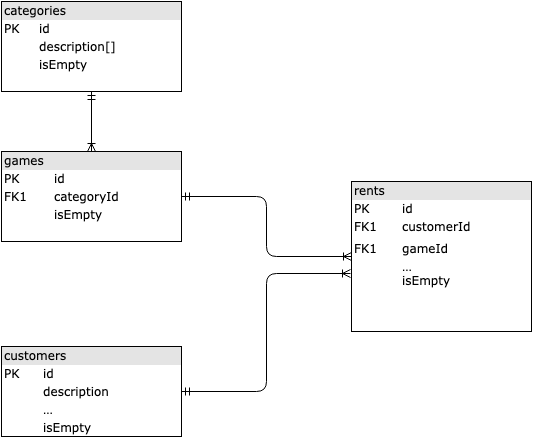

# Primer Parcial de Laboratorio 1

## Parcial completo sin pruebas
```bash
git checkout 28ec6e0604330f15577241650cf3399cfd65694e
```
## Volver a la version de pruebas
```bash
git checkout master
```
